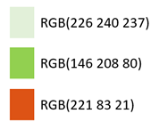
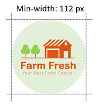
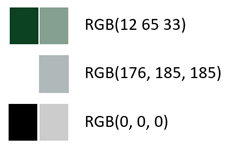

Design Guide
1. Logo

    1.1	logo colors

    

    1.2	logo size

    

    1.3	logo usage

    Logo should only be used on webpage header.

2.	Font

    2.1	font family

    SoDoSans, Helvetica Neue, Helvetica, Arial, sans-serif;

3.	Color Pallets
 
    

4.	Button

    4.1	Button border

    Login-in button: solid border
    Other button: no border

    4.2	utton color

    Login-in button: RGB(0, 128, 0)

    Other button: RGB(12, 65, 33)
    
    4.3	Button position
    Button is at the right bottom part of the product information box.
5.	Spacing
    Padding master : 10%
6.	Design guideline for mobile devices
    The main content of the website, i.e. product information, will be displayed vertically on mobile devices and will be displayed horizontally on computer screen size.
7.	Header and Footer
    7.1 Different headers should be applied based on user status.

